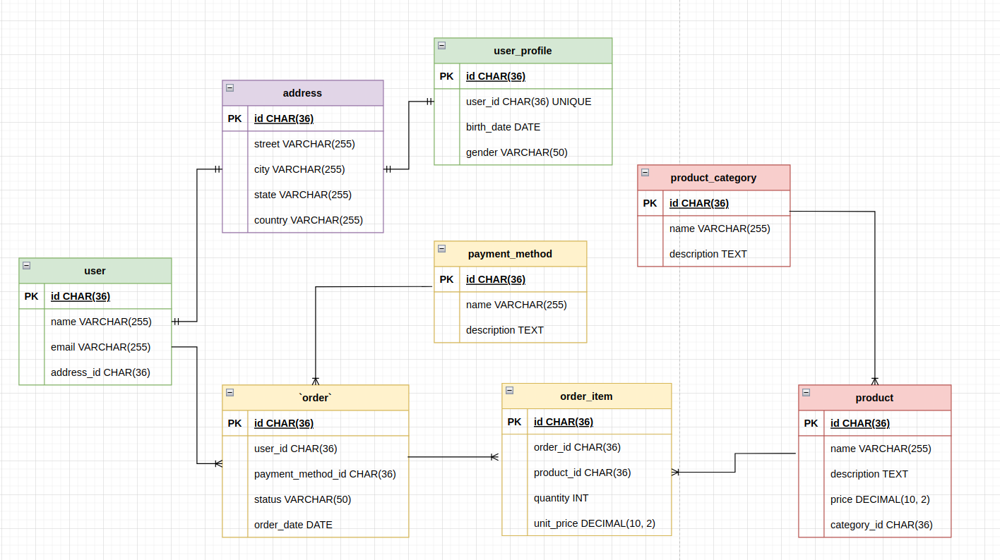

# Data Modeling

Nesta seção, abordaremos os princípios e práticas de modelagem de dados em MySQL. A modelagem de dados é crucial para o design eficaz de bancos de dados, garantindo que os dados sejam organizados de forma lógica e eficiente. Abordaremos os seguintes tópicos:

- **Entidades e Atributos**: Descrevendo entidades e seus atributos, bem como a identificação de chaves primárias e estrangeiras.
- **Relacionamentos**: Definindo e implementando relacionamentos entre entidades, como 1-para-1, 1-para-N e N-para-N.
- **Normalização**: Explorando os conceitos de normalização de dados para evitar redundância e inconsistência.
- **Modelagem Física**: Considerando a implementação física do modelo, incluindo índices, partições e otimizações de desempenho.
- **Ferramentas de Modelagem**: Apresentando ferramentas populares de modelagem de dados para auxiliar no design e na documentação do modelo.

## Entidades e Atributos

Na modelagem de dados, as entidades representam objetos do mundo real, como pessoas, lugares ou coisas, que são significativas para o sistema. Os atributos são características dessas entidades, que descrevem seus detalhes ou propriedades. 
No nosso modelo:

- ### **Entidades**
    - **Address**: Representa um endereço com atributos como rua, cidade, estado e país.
    - **User**: Representa um usuário com atributos como nome, e-mail e uma chave estrangeira para o endereço associado.
    - **User_Profile**: Representa o perfil de um usuário, com atributos como data de nascimento, gênero e uma chave estrangeira para o usuário associado.
    - **Product_Category**: Representa a categoria de um produto, com atributos como nome e descrição.
    - **Product**: Representa um produto com atributos como nome, descrição, preço e uma chave estrangeira para a categoria associada.
    - **Payment_Method**: Representa um método de pagamento com atributos como nome e descrição.
    - **Order_Item**: Representa um item de pedido com atributos como quantidade, preço unitário e chaves estrangeiras para o pedido e o produto associados.
    - **Order**: Representa um pedido com atributos como status, data do pedido e chaves estrangeiras para o usuário e o método de pagamento associados.

- ### **Atributos**:

    - **ID**: Identificador único para cada entidade.
    - **Name**: Nome da entidade, como o nome do usuário ou do produto.
    - **Email**: Endereço de e-mail do usuário.
    - **Birth_Date**: Data de nascimento do usuário.
    - **Gender**: Gênero do usuário.
    - **Description**: Descrição da categoria, produto ou método de pagamento.
    - **Price**: Preço do produto.
    - **Quantity**: Quantidade do produto no pedido.
    - **Unit_Price**: Preço unitário do produto no pedido.
    - **Status**: Status do pedido.

Essa descrição destaca as entidades e atributos do modelo de dados, essenciais para entender como os dados são estruturados e como as entidades estão relacionadas entre si.

## **Relacionamentos**

Os relacionamentos definem como as entidades interagem entre si no modelo de dados. 
No modelo fornecido, temos vários tipos de relacionamentos: um-para-um (1:1), um-para-muitos (1:N). Vamos analisar cada relacionamento presente no modelo:

- Um-para-um (1:1):

  - User e User_Profile:
    - Cada usuário possui um único perfil e cada perfil está associado a um único usuário.
    - Implementado através de uma chave estrangeira (user_id) na tabela user_profile que referencia a chave primária na tabela user.

- Um-para-muitos (1:N):

  - Address e User:
    - Um endereço pode estar associado a muitos usuários, mas cada usuário possui apenas um endereço.
    - Implementado através de uma chave estrangeira (address_id) na tabela user que referencia a chave primária na tabela address.

  - Product_Category e Product:
    - Uma categoria de produto pode incluir muitos produtos, mas cada produto pertence a apenas uma categoria.
    - Implementado através de uma chave estrangeira (category_id) na tabela product que referencia a chave primária na tabela product_category.
      
  - User e Order:
    - Um usuário pode fazer muitos pedidos, mas cada pedido é feito por um único usuário.
    - Implementado através de uma chave estrangeira (user_id) na tabela order que referencia a chave primária na tabela user.

  - Payment_Method e Order:
    - Um método de pagamento pode ser usado em muitos pedidos, mas cada pedido usa apenas um método de pagamento.
    - Implementado através de uma chave estrangeira (payment_method_id) na tabela order que referencia a chave primária na tabela payment_method.

  - Order e Order_Item:
    - Um pedido pode ter muitos itens de pedido, mas cada item de pedido está associado a apenas um pedido.
    - Implementado através de uma chave estrangeira (order_id) na tabela order_item que referencia a chave primária na tabela order.

  - Product e Order_Item:
    - Um produto pode estar presente em muitos itens de pedido, mas cada item de pedido está associado a apenas um produto.
    - Implementado através de uma chave estrangeira (product_id) na tabela order_item que referencia a chave primária na tabela product.

Neste modelo de dados, os relacionamentos são implementados principalmente através do uso de chaves estrangeiras, que garantem a integridade referencial entre as tabelas. Esses relacionamentos são fundamentais para garantir que os dados sejam armazenados de forma consistente e que as associações entre diferentes entidades sejam mantidas corretamente.

Embora não estejam presentes no DDL fornecido, outros tipos de relacionamentos comuns em modelos de dados incluem:

- Muitos-para-muitos (N:N):
  - Exemplo: Estudantes e cursos. Um estudante pode estar matriculado em muitos cursos, e um curso pode ter muitos estudantes matriculados.
  - Implementação: Geralmente, é necessária uma tabela intermediária que contém chaves estrangeiras de ambas as tabelas principais. Por exemplo, uma tabela student_course que possui as colunas student_id e course_id como chaves estrangeiras.

- Auto-relacionamento (1:1, 1:N, N:N dentro da mesma tabela):
  - Exemplo: Funcionários e gerentes. Um funcionário pode ser gerente de outros funcionários na mesma tabela.
  - Implementação: Usar uma chave estrangeira na tabela que referencia a própria chave primária da mesma tabela. Por exemplo, manager_id na tabela employee que referencia id na mesma tabela.

Esses tipos de relacionamentos são fundamentais em diferentes cenários de modelagem de dados, permitindo a representação de associações complexas e hierarquias dentro do banco de dados.

## **Normalização**

Normalização é o processo de organizar os dados em um banco de dados para reduzir a redundância e melhorar a integridade dos dados. Esse processo é realizado em várias etapas, chamadas formas normais, cada uma das quais constrói sobre a anterior.

### Formas Normais

1. Primeira Forma Normal (1NF):
   - Objetivo: Eliminar grupos repetidos e garantir que cada campo contenha apenas valores atômicos.
   - Exemplo: Uma tabela student onde cada estudante tem uma lista de telefones. Na 1NF, os telefones seriam armazenados em linhas separadas ou em uma tabela separada.

2. Segunda Forma Normal (2NF):
   - Objetivo: Eliminar dependências parciais. Os atributos não-chave devem depender totalmente da chave primária.
   - Exemplo: Uma tabela orders onde cada pedido contém o ID do cliente e o nome do cliente. Na 2NF, o nome do cliente seria movido para uma tabela separada customers e referenciado por meio de uma chave estrangeira.

3. Terceira Forma Normal (3NF):
   - Objetivo: Eliminar dependências transitivas. Os atributos não-chave devem depender apenas da chave primária e não de outros atributos não-chave.
   - Exemplo: Uma tabela orders onde cada pedido contém o ID do cliente, o nome do cliente e o endereço do cliente. Na 3NF, o endereço do cliente seria movido para a tabela customers para evitar dependências transitivas.

**Benefícios da Normalização**
  - **Redução da Redundância**: Elimina dados duplicados, economizando espaço de armazenamento.
  - **Melhoria da Integridade dos Dados**: Garante que os dados sejam consistentes e precisos.
  - **Facilidade de Manutenção**: Simplifica operações de inserção, atualização e exclusão.

**Desvantagens da Normalização**
  - **Complexidade**: Pode tornar o design do banco de dados mais complexo.
  - **Performance**: Pode exigir mais junções (joins) entre tabelas, o que pode impactar a performance das consultas.

A normalização é uma técnica essencial para o design eficiente de bancos de dados, balanceando entre a eliminação de redundâncias e a manutenção de performance adequada.

Ao analisar nosso exemplo, podemos verificar como as tabelas foram projetadas em relação aos princípios de normalização. A seguir, descrevemos como cada tabela está normalizada de acordo com as primeiras três formas normais (1NF, 2NF e 3NF):

- Primeira Forma Normal (1NF)
  - Para estar na 1NF, cada tabela deve ter:
    - Colunas contendo apenas valores atômicos (sem listas ou conjuntos).
    - Colunas que contenham valores do mesmo tipo.
    - Cada coluna deve ter um nome único.
    - A ordem em que os dados são armazenados não deve importar.
    - Não há repetição de colunas

- Segunda Forma Normal (2NF)
  - Para estar na 2NF, a tabela deve estar na 1NF e todos os atributos não-chave devem depender completamente da chave primária.
    - Todas as tabelas têm uma chave primária clara e todos os atributos não-chave dependem completamente da chave primária. Por exemplo, na tabela user, todos os atributos (name, email, address_id) dependem da chave primária id.

- Terceira Forma Normal (3NF)
  - Para estar na 3NF, a tabela deve estar na 2NF e não deve haver dependências transitivas, ou seja, os atributos não-chave devem depender apenas da chave primária.
    - As tabelas no DDL também atendem a este critério. Por exemplo, na tabela order, os atributos user_id e payment_method_id dependem da chave primária id da tabela order, e as informações detalhadas de user e payment_method são armazenadas em suas respectivas tabelas (user e payment_method), evitando dependências transitivas.

## Modelagem Física

A modelagem física refere-se à implementação prática do modelo de dados lógico em um sistema de gerenciamento de banco de dados (SGBD). Envolve a criação de estruturas de armazenamento específicas que permitem a recuperação eficiente e a manipulação dos dados. Durante a modelagem física, consideramos aspectos técnicos e de desempenho, incluindo índices, particionamento, tipos de dados, e otimizações específicas para o SGBD em uso.

### Componentes da Modelagem Física

1. Tabelas e Colunas:
   - Definição das tabelas e colunas conforme o modelo lógico.
   - Seleção dos tipos de dados apropriados para cada coluna para otimizar armazenamento e desempenho.

2. Índices:
   - Criação de índices para acelerar consultas frequentes.
   - Consideração do tipo de índice (por exemplo, B-tree, hash) e colunas indexadas.

